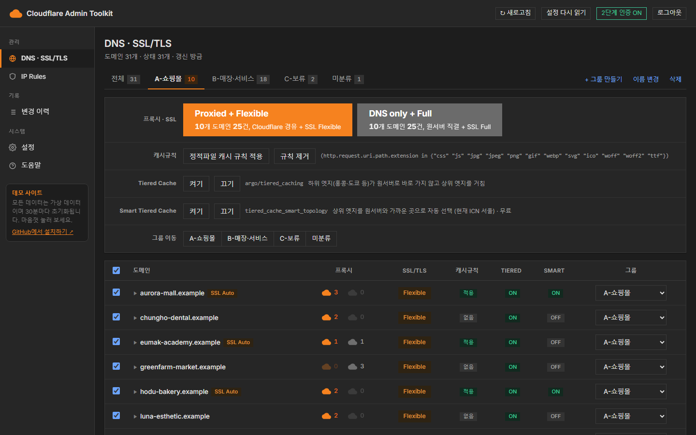
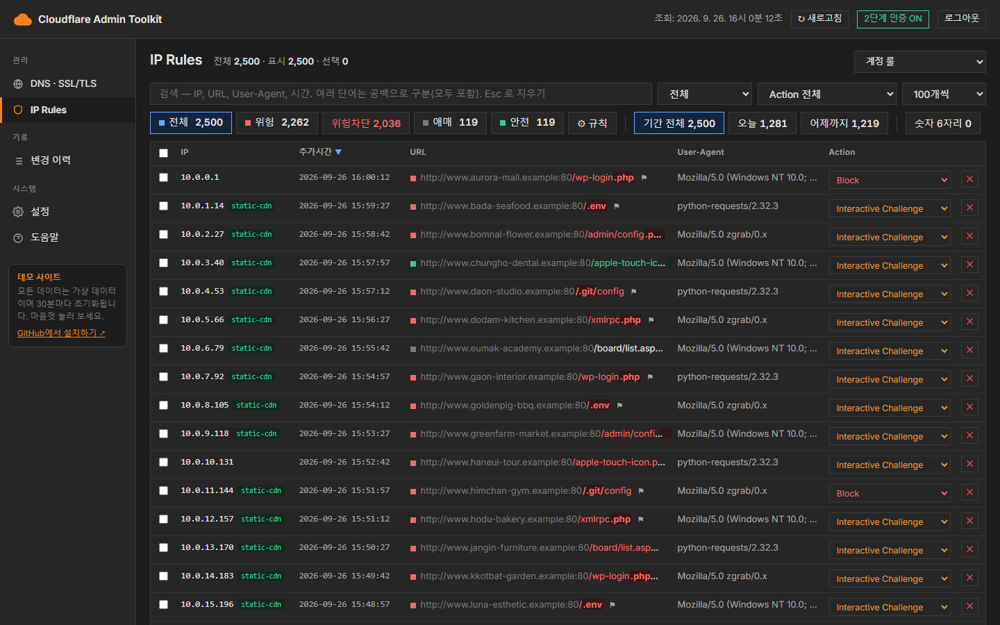

# cloudflare-admin-toolkit

[English](README.md) | **한국어**


**Cloudflare 도메인이 많을 때, 대시보드 메뉴를 하나씩 들어가지 않고 한 화면에서 여러 도메인을 한꺼번에 관리하는 도구입니다.**
내 Cloudflare 계정의 Workers(무료 요금제)에 직접 올려서 쓰는 셀프호스팅 방식이고, 화면은 한국어입니다.

**[데모 사이트 →](https://cf-admin-demo.now100k.com)** — 로그인 없이 바로 볼 수 있습니다. 도메인 · IP 룰 · 이력 전부 가상 데이터라 마음껏 눌러 봐도 되고, 30분마다 초기화됩니다.





---

## 왜 만들었나

도메인이 수십 ~ 수백 개가 되면, 서버를 옮기거나 장애가 났을 때 도메인마다 대시보드에 들어가 프록시 · SSL · 캐시 설정을 하나씩 바꿔야 합니다.
이 도구는 그 일을 **그룹 단위로 한 번에**, 바뀌는 내용을 **미리 보고**, 누가 무엇을 바꿨는지 **기록을 남기며** 할 수 있게 합니다.

## 기능

| 메뉴 | 하는 일 |
|---|---|
| **DNS · SSL/TLS** | 대상 서버 IP 를 가리키는 A/AAAA 레코드를 Proxied ↔ DNS only 로 일괄 전환 + SSL/TLS 모드 동시 변경 (미리보기 → 적용 · 되돌리기). 정적파일 캐시 규칙 · Tiered Cache · Smart Tiered Cache 일괄 켜기/끄기. 도메인 그룹 관리 |
| **IP Rules** | 계정 IP Access Rules 조회 · 검색 · 분류(위험 / 애매 / 안전 — 규칙 편집 가능) · 삭제 · Action 변경. 자산존 Allow 예외 룰을 짝으로 함께 관리(선택) |
| **변경 이력** | 누가 · 언제 · 무엇을 바꿨는지 (도메인 · IP 룰 · OTP · 설정 모두). 프록시 · SSL 은 되돌리기 가능 |
| **설정** | 대상 IP · 기본 그룹 · 캐시 시간 · 자산존 · 호출 상한 · OTP 앱 이름을 화면에서 변경 |
| **도움말** | 새 Cloudflare 계정에 설치하는 방법 (단계별) |

안전장치
- 대상 IP 가 아닌 레코드(메일 · 다른 서버 등)는 `보호` — 화면에서 골라도 **서버가 막습니다**
- 적용 직전에 Cloudflare 에서 현재 상태를 **다시 읽고** 판단합니다 (대시보드에서 누가 바꿨어도 안전)
- Cloudflare API 한도(사용자당 5분 1,200회)와 Workers 무료 요금제 제한(요청당 외부 호출 50회)에 맞춰 잘게 나눠 부릅니다

로그인
- 비밀번호 + **사람별 구글 OTP**. 처음 등록한 사람이 관리자 — 다른 사람 추가 · 사용중지 · 삭제 (사용중지하면 그 사람 창도 즉시 끊김)
- 세션 12시간, IP 당 10분에 10번 틀리면 잠시 막힘

## 빠른 시작 — 명령 하나로 설치

**준비물**: Cloudflare 계정(무료 요금제 가능), [Node.js](https://nodejs.org) 18 이상

### 1. API 토큰 만들기

Cloudflare 대시보드 → 오른쪽 위 프로필 → **My Profile → API Tokens → Create Token → Custom token**

| 토큰 | 권한 |
|---|---|
| 도메인 → `CF_API_TOKEN` | `Zone · Zone · Read` / `Zone · DNS · Edit` / `Zone · Zone Settings · Edit` / `Zone · Cache Rules · Edit`<br>Zone Resources: `Include · All zones from an account` |
| IP Rules → `CF_IP_TOKEN` (선택) | `Account · Account Firewall Access Rules · Edit` / `Zone · Firewall Services · Edit` / `Zone · Zone · Read` |

Client IP Filtering 은 비워 두세요 (Workers 는 나가는 IP 가 바뀝니다).

### 2. 받아서 설정 파일 만들기

```bash
git clone https://github.com/real21c/cloudflare-admin-toolkit.git
cd cloudflare-admin-toolkit
node setup.mjs --init
```

생긴 `setup.env` 의 빈 칸을 채웁니다. 필수는 네 개입니다.

| 이름 | 값 |
|---|---|
| `WORKER_NAME` | Worker 이름 (영문 소문자 · 숫자 · -). 주소가 `<이름>.<서브도메인>.workers.dev` 가 됩니다 |
| `CF_API_TOKEN` | 1단계에서 만든 도메인 토큰 |
| `PASSWORD_PREFIX` | 로그인 비밀번호 앞부분 (아래 참고) |
| `SERVER_IP` | 일괄 변경할 대상 서버 IP |

wrangler 에 Cloudflare 계정이 여러 개 연결돼 있으면 `ACCOUNT_ID` 도 적습니다. 나머지 칸은 비워 두면 기본값을 씁니다.

### 3. 설치

```bash
node setup.mjs --dry-run     # 먼저 확인만 — 값 · 토큰 · 로그인 · 빌드 검사 (아무것도 만들지 않음)
node setup.mjs               # 설치
```

스크립트가 wrangler 로그인(브라우저) → KV 만들기 → 배포(시크릿 함께) 까지 하고, 주소와 첫 로그인 방법을 알려 줍니다.

- 올린 토큰 · 비밀번호는 `setup.env` 에서 자동으로 지웁니다 (`setup.env` 는 git 에 올라가지 않습니다)
- 계정에 이미 같은 이름의 Worker 가 있으면 덮어쓰지 않고 멈춥니다
- 손으로 하나씩 설치하는 방법과 모든 변수 · 시크릿 설명은 화면의 **도움말** 메뉴(`public/help.html`)에 있습니다

### 4. 첫 로그인 · OTP 등록 (꼭)

- 비밀번호 = `PASSWORD_PREFIX` + `!` + 오늘 날짜 두 자리(한국 시간). 예) 접두어 `abc`, 5일이면 `abc!05`
- 로그인하자마자 위쪽 **2단계 인증**에서 구글 OTP 를 등록하세요. 등록 전에는 비밀번호만 알면 누구나 들어올 수 있고, 날짜 부분은 추측할 수 있으니 접두어는 길게 정하세요

## 업데이트 · 삭제

```bash
git pull
node setup.mjs               # 같은 setup.env 로 다시 실행하면 업데이트 (비워 둔 시크릿은 그대로 유지)
```

설정 값을 바꾸고 싶을 때도 `setup.env` 를 고치고 다시 실행하면 됩니다. 대상 IP 같은 값은 화면의 **설정** 메뉴에서도 바꿀 수 있습니다.

삭제하려면:

```bash
npx wrangler delete --config wrangler.setup.jsonc
npx wrangler kv namespace delete --namespace-id <KV id> --config wrangler.setup.jsonc   # KV id 는 .setup-state.json 에 있음
```

## 비용과 한도

모두 무료 요금제 안에서 동작합니다.

| 항목 | 무료 한도 | 이 도구 |
|---|---|---|
| Workers 요청 | 하루 10만 | 화면 이동 · API 호출마다 1건 |
| KV 쓰기 | 하루 1,000 | 변경 · 이력 · 상태 캐시 저장 |
| Cloudflare API | 사용자당 5분 1,200회 (요금 없음) | 도메인 상태 조회 1회 ≈ 도메인 수 × 2. IP Rules 화면은 5분 900회 아래로 스스로 늦춤 |

## 알아 둘 점

- 화면은 한국어, 시간 표시는 한국 시간(KST) 기준입니다
- 관리 대상 도메인에 Worker **route 를 걸지 마세요**. 그 도메인을 DNS only 로 바꾸는 순간 도구도 끊깁니다. `workers.dev` 주소나 Custom Domain 을 쓰세요
- **IP Rules** 는 룰 메모가 `추가시간 | URL | User-Agent` 형식이면 칸을 나눠 보여 주고, 아니면 메모 전체를 한 칸에 보여 줍니다. 자산존 짝 기능은 `IP_PAIR_ZONE_NAME` 을 정했을 때만 동작합니다 (메모에 `404 guard` 가 들어간 Allow 룰만 짝으로 봄)
- **기본 분류 규칙은 ASP/IIS 서버 기준**입니다 (예: PHP 확장자 요청을 `위험`으로 분류). 다른 서버라면 IP Rules 의 `⚙ 규칙` 에서 맞게 고치세요
- 캐시 규칙은 설명 `static-assets (cloudflare-admin-toolkit)` 으로 자기 규칙을 찾습니다. 규칙을 건 뒤에 `src/core.js` 의 `CACHE_RULE_DESC` 를 바꾸면 예전 규칙을 못 찾습니다
- `DNS only` 로 바꾸면 그 레코드는 캐시 · WAF · Workers route 가 모두 빠지고 원서버 IP 가 드러납니다. `Flexible` 은 원서버가 HTTPS 로 리다이렉트하면 무한 리다이렉트가 납니다

## 로컬 실행 (선택)

Workers 가 안 될 때를 대비해 PC 에서 같은 화면을 띄울 수 있습니다. `127.0.0.1` 에서만 열리고 로그인은 없습니다.

```bash
cp config.example.json config.json   # token 등을 채운다
node server.mjs                       # → http://127.0.0.1:8790
```

로컬 데이터는 `data/` 에 따로 저장되어 Workers 쪽과 공유되지 않습니다.

## 구조

```
setup.mjs            설치 · 업데이트 스크립트
server.mjs           로컬 서버 (Node 내장 모듈만)
wrangler.jsonc       직접 배포할 때 쓰는 설정 템플릿
src/worker.js        Workers 진입점 — 로그인 · 세션 · OTP · 정적 파일
src/api.js           API (로컬 · Workers 공용)
src/core.js          Cloudflare API 호출 · 범위 계산 · 캐시 규칙
src/ip-api.js        IP Rules API
src/settings.js      설정 항목 · 값 검사
public/              화면 (index · ip · settings · help)
```

의존성은 없습니다 (QR 코드 생성기 `src/vendor/qrcode.mjs` 는 MIT 라이선스로 포함).

## 문의 · 기여

버그나 제안은 [Issues](https://github.com/real21c/cloudflare-admin-toolkit/issues) 에 남겨 주세요.
기타 문의는 real21c@gmail.com 으로 보내 주세요.

## 라이선스

MIT — [LICENSE](LICENSE)
